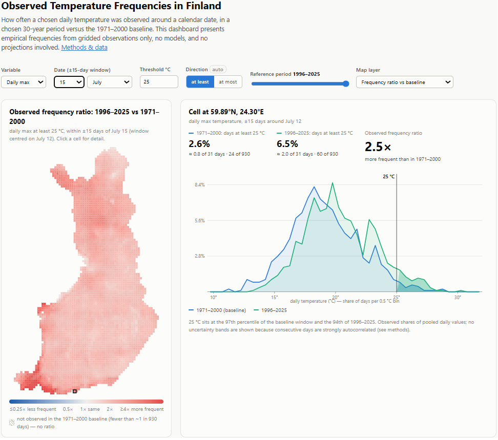
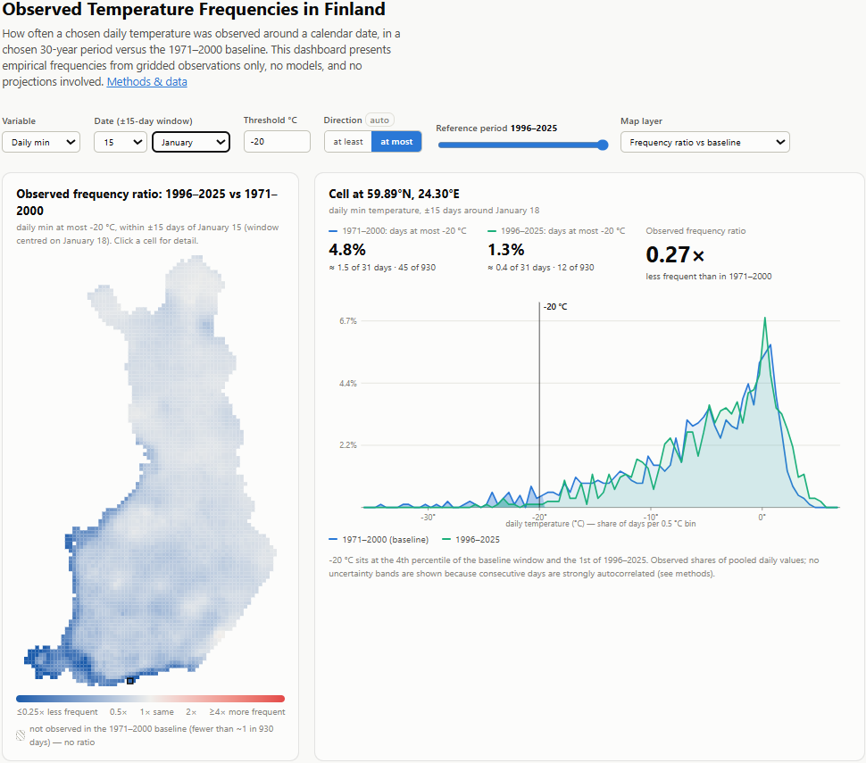

# Finland Climate (Temperature) Probability Dashboard
*Note: Claude Code is used, especially for developing the front-end.*

**How often does Helsinki see a 25 °C July day now, compared with the 1971–2000
climate?** This tool answers questions of that kind for any point in Finland, any
calendar date, and any temperature threshold (using observed data only).

Pick a location on the map, a date, a temperature, and a reference year. The
dashboard shows the *observed frequency* of days at/beyond your threshold in the
30-year climate window ending in your reference year, side by side with the fixed
1971–2000 baseline, and the ratio between the two — e.g. *"25 °C days around July 15
were observed 2.1× more frequently in 1996–2025 than in 1971–2000."*



## No causation claim

This is a **detection** tool, not an attribution tool. It visualizes frequencies in
observational data and reports how they differ between periods. It makes **no causal
claims** anywhere. For the causes behind climate change, please refer to: [IPCC AR6 WG1 chapter 3](https://www.ipcc.ch/report/ar6/wg1/chapter/chapter-3/)
and [World Weather Attribution](https://www.worldweatherattribution.org/).

## The dashboard

- **Map of Finland** (~10 km grid, 3,911 land cells) with three layers:
  - **Frequency ratio** (headline): chosen window vs baseline, diverging palette
    centered at 1, log-scaled, clamped to 0.25×–4× (exact values on hover). Cells
    where the baseline never reached the threshold render hatched as "not observed"
    — never as infinity.
  - **Observed frequency** of the chosen window (sequential palette).
  - **Threshold minus baseline median** (orientation layer).
- **Cell detail view**: the two overlaid empirical temperature distributions with
  the threshold line and shaded tails, both absolute frequencies, the directional
  ratio, and expected days per 31-day window.
- **Controls**: variable (daily mean/max/min), date, threshold (0.5 °C steps),
  at-least/at-most direction (auto-defaulted from the baseline median, overridable),
  reference year 2000–2025, map layer.
- A full **methods note** is built into the page.

Everything is static files — there is no backend. A query fetches two ~165 KB
(gzipped) histogram files; all statistics are computed in the browser.

The direction toggle auto-flips with the query: a winter cold-tail question shows,
for example, that −20 °C January days in Helsinki were observed about half as
frequently in 1996–2025 as in the baseline:



## Methodology

- **Pooling:** a query pools all days within **±15 days** of the chosen calendar
  date (a 31-day window) across the **30 years ending in the chosen reference year**,
  inclusive: reference year R covers R−29…R. Windows wrap across the year boundary
  (early-January windows include late-December days of the preceding years); Feb 29
  is dropped. Sample size ≈ 31 × 30 = 930 daily values per estimate.
- **Baseline:** fixed at reference year 2000, i.e. **1971–2000**.
- **Estimation:** purely empirical. Daily values are counted into fixed **0.5 °C
  bins** (−45…+40 °C; rarer values below −45 °C count in the lowest bin). The
  observed frequency is the tail share of the pooled histogram; the **frequency
  ratio** divides the chosen window's share by the baseline share. Both absolute
  shares are always displayed with the ratio.
- **Empty tails are reported, not extrapolated:** if a window contains no days
  at/beyond the threshold, the tool says "not observed (fewer than ~1 in 930 days)"
  and shows no ratio. Nothing is fitted or smoothed.
- **Precomputation:** per-year histograms are assembled once from the raw grids;
  30-year windows are sums of per-year histograms; the frontend fetches precomputed
  histograms per (variable, reference year, week). Dates snap to the nearest of 52
  weekly window centers (≤ 4 days; neighboring windows share 28+ of 31 pooled days).

### Caveats

- Consecutive days are strongly autocorrelated, so ~930 pooled values contain far
  fewer independent samples. Point estimates are unbiased, but **no uncertainty
  bands are shown** — naïve intervals would be misleadingly narrow.
- The 31-day window blends the seasonal trend within the window.
- 30-year windows for reference years before 2030 **overlap** the baseline;
  differences between overlapping windows understate differences between disjoint
  periods.
- "Chance of a 30 °C day" colloquially refers to the **daily maximum** variable.

## Data

**FMI ClimGrid** — the Finnish Meteorological Institute's daily gridded
observational dataset for Finland: ~10 km grid (EPSG:3067), 1961–2025, daily mean,
maximum, and minimum temperature. © Finnish Meteorological Institute, licensed
**CC BY 4.0**, distributed via the [Paituli](https://paituli.csc.fi/) spatial data
service (CSC) on the funet.fi file server.

Dataset reference: Aalto, J., P. Pirinen, and K. Jylhä (2016), *New gridded daily
climatology of Finland: Permutation-based uncertainty estimates and temporal trends
in climate*, J. Geophys. Res. Atmos., 121, [doi:10.1002/2015JD024651](https://doi.org/10.1002/2015JD024651).

The download step records every source file's URL, size, sha256, and Last-Modified
in a manifest, so the exact dataset version behind any build is pinned and auditable.

## Reproduce it

Requirements: Python ≥ 3.10, ~15 GB free disk, network access. The pipeline is a
single sequence of idempotent, restartable scripts — re-running skips completed work.

```bash
git clone <this-repo> finland_climate_map && cd finland_climate_map
python3 -m venv .venv && .venv/bin/pip install -r requirements.txt

.venv/bin/python scripts/download_climgrid.py           # ~2.2 GB raw NetCDF from FMI
.venv/bin/python scripts/build_yearly_layers.py         # per-year binned layers (~100 MB)
.venv/bin/python scripts/build_window_histograms.py     # 30-year windows (~5 GB, ~40 min)
.venv/bin/python scripts/export_web_assets.py           # static web data (~5 GB)

python3 -m http.server 8137                             # from the project root
# open http://localhost:8137/web/
```

Each stage has an independent verification script that checks it against the stage
before it (bin-for-bin histogram equality on random draws, totals, and known
climatology such as Helsinki summer / Sodankylä winter frequencies):

```bash
.venv/bin/python scripts/verify_layers.py
.venv/bin/python scripts/verify_windows.py
.venv/bin/python scripts/verify_web_assets.py
```

### Updating when a new data year is published

Bump `LAST_YEAR` in `scripts/climgrid_common.py` and `scripts/download_climgrid.py`,
`LAST_REF_YEAR` in `scripts/build_window_histograms.py`, the slider `max` in
`web/index.html`, and re-run the four pipeline commands — only the new year is
downloaded and layered, and windows are re-summed from layers.

## Repository layout

```
scripts/
  download_climgrid.py        step 1: raw data download + provenance manifest
  build_yearly_layers.py      step 2: per-year binned daily layers
  build_window_histograms.py  step 3: 30-year window histograms (sums of step 2)
  export_web_assets.py        step 4: static files the frontend fetches
  verify_*.py                 per-stage verification
  climgrid_common.py          shared constants (bins, calendar, paths)
web/
  index.html, app.js, style.css   dependency-free frontend (no build step)
data/                         (gitignored) raw + derived data, regenerated by the pipeline
```

## Deploying

The app is static: host `web/` and `data/web/` side by side on any static file
server or object storage (~5 GB; ~800 MB if precompressed). Make sure `.bin` files
are served compressed (`Content-Encoding: gzip` or server-side compression of
`application/octet-stream`) — it's a 6× transfer saving. To place data elsewhere,
change the `DATA_BASE` constant at the top of `web/app.js`.

## License

- **Data:** © Finnish Meteorological Institute, [CC BY 4.0](https://creativecommons.org/licenses/by/4.0/).
  Derived histogram files retain this license and attribution.
- **Code:** MIT — see [LICENSE](LICENSE).
